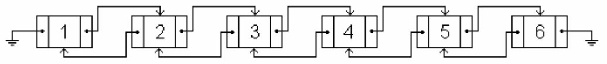
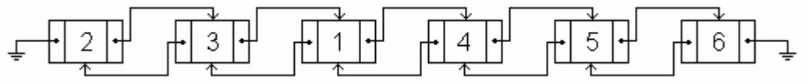
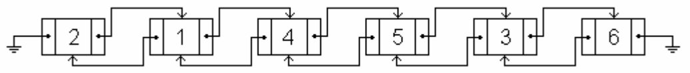

# 2022-CRA-DSCamp
2일차 상 문제 2 (조금 수정 있어요!)

[문제 링크 : https://www.acmicpc.net/problem/3045](https://www.acmicpc.net/problem/3045)

## 문제

창영이는 1학년 때 숙제로 했던 이중 연결 리스트 소스를 상근이에게 생일 선물로 보내주었다. 상근이는 드디어 자신이 원하던 기능이 있는 소스를 받게 되어서 매우 기뻤다. 상근이는 하루종일 이 리스트를 가지고 놀려고 한다.

리스트에는 총 N개의 노드가 포함되어 있고, 가장 왼쪽 노드가 1번이며 나머지는 오른쪽으로 갈 수록 1씩 번호가 증가한다. 리스트가 수행할 수 있는 연산은 아래와 같이 2가지이다.

A) 노드 X를 노드 Y의 앞으로 이동

B) 노드 X를 노드 Y의 뒤으로 이동

아래 그림은 노드가 6개인 이중 연결 리스트의 모습이다.



여기에 "A 1 4" 연산을 수행하면 아래와 같이 된다. (노드 1을 노드 4의 앞으로 이동)



그 다음, "B 3 5" 연산을 수행하면 아래 그림과 같은 모습이 된다. (노드 3을 노드 5의 뒤로 이동)



리스트를 가지고 다 논 다음에는 처음 상태로 다시 만들어야 한다. 따라서, 상근이는 리스트에 연산을 입력할 때 마다 종이에 적어두었다.

상근이가 입력한 연산이 모두 주어졌을 때, 처음 상태로 만들기 위해 리스트가 수행해야 하는 연산의 횟수를 구하는 프로그램을 작성하시오. 이때, 연산을 되도록 적게 사용해야 한다.

## 원 문제에서의 수정사항
연산을 구하는 것은 DP를 이용해야해서, 연산의 횟수를 구하는 것으로 바꿨어요!

## 입력

첫째 줄에 노드의 수 N과 연산의 수 M이 주어진다. (2 ≤ N ≤ 500,000, 0 ≤ M ≤ 100,000)

다음 M개 줄에는 상근이가 입력한 연산이 문제 설명에 나온 형식으로 주어진다.

## 출력

첫째 줄에 처음 상태로 만들기 위해서 필요한 연산의 최솟값을 출력한다. 이 값을 K라고 한다.

## 예제 입력 1

```

2 1
A 2 1

```

## 예제 출력 1

```

1

```

## 예제 입력 2

```

4 3
B 1 2
A 4 3
B 1 4

```

## 예제 출력 2

```

2

```

## 예제 입력 3

```

6 5
A 1 4
B 2 5
B 4 2
B 6 3
A 3 5

```

## 예제 출력 3

```

3

```